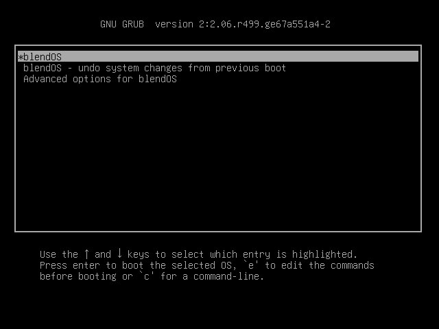

# Architecture

blendOS has a wildly different approach to immutability from other distributions.

## Overlays

`overlayfs` is used to mount empty directories on top of the root's system directories. These directories are written to during system updates and the installation of **drivers**/**kernel modules**/**apps installed through pacman**.

This also prevents applications from writing to the main system root itself, which remains untouched until the next boot.

## Merge-on-boot

When booting, the user is presented with two options (aside from other operating systems and 'Advanced options').

**First option**: Merges the previous boot's overlay with the current filesystem, using *overlayfs-tools*. It then creates a fresh new overlay in-place of the previous one.

**Second option**: Deletes the previous boot's overlay, and creates a new one, discarding changes to the root partition from the previous boot.

*Potential contribution: Any help with a user-friendly GRUB theme would be greatly appreciated!*

## Internals

### Boot hooks

The [blend hook](https://github.com/blend-os/blend/blob/main/blend.hook) for **mkinitcpio** mounts all of the overlays on boot. There are plans to implement support for snapshots too, that would allow for rolling back to a known working state in the event that anything goes wrong.

### Overlayed directories

All of the overlayed directories are under `/.upperdir`, on the same partition as the root partition.

|         Overlays         |  System directories  |
|--------------------------|----------------------|
| /.upperdir/bin           | /usr/bin             |
| /.upperdir/include       | /usr/include         |
| /.upperdir/lib           | /usr/lib             |
| /.upperdir/lib32         | /usr/lib32           |
| /.upperdir/share         | /usr/share           |
| /.upperdir/src           | /usr/src             |
| /.upperdir/varlib        | /usr/varlib          |