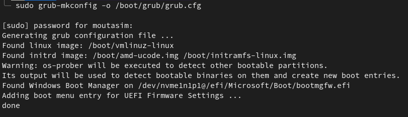

# Dual boot blendOS with Windows
This documentation will show you how to install blendOS with Windows dual boot (Separate drive approach) using Grub. Grub is a boot loader that allows you to choose between different operating systems when you start your computer.

To install blendOS with Windows dual boot using Grub, you will need the following:

-	A machine with blendOS and windows (Separate drive)
-	Root access
-	BlendOS up and running

Once your installation is successful, Open your terminal (Console) and write the following command for installing grub:
	
	grub-install

Then for detecting other operating systems that are installed on your machine hard drive, execute `os-prober` which will auto report the results to the boot loader.
	
	os-prober #add sudo if needed

If you faced any error, enable os-prober (if not already enabled) by editing the /etc/default/grub file and making sure the line `GRUB_DISABLE_OS_PROBER=false` is present and not commented out, the run the command again.

Lastly just run the makeconfig for generating the grub configuration.

This will ensure that grub is correctly installed, other operating systems are detected, and the grub configuration file is updated with the correct boot entries.