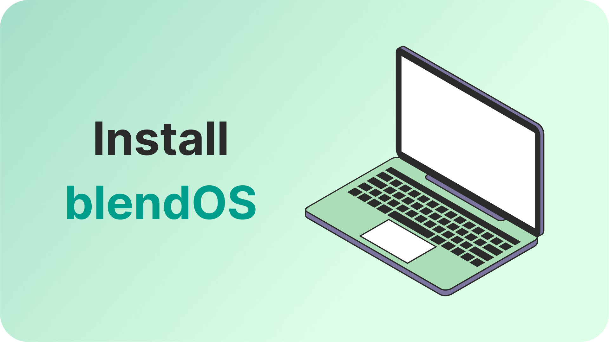
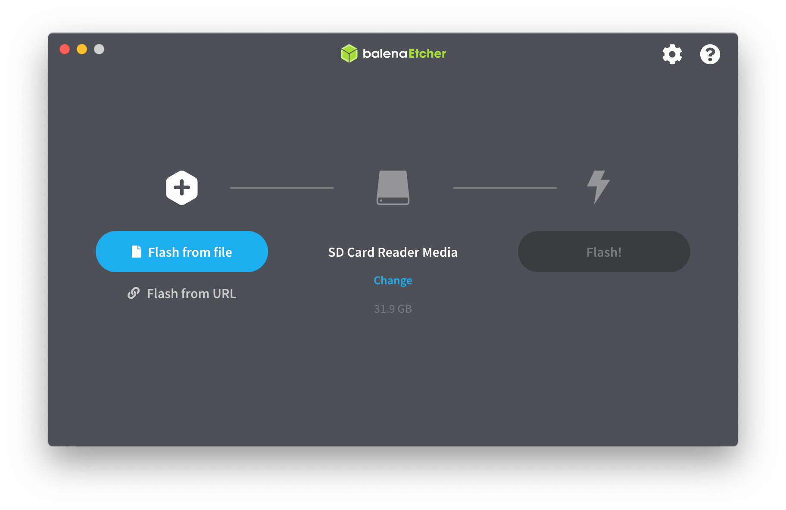

Learn how to install blendOS on your computer through this guide!

## What you'll need

* A 64-bit CPU, from no earlier than 2009.
* A minimum of 4 GBs of RAM and 25 GBs of storage.
* A spare USB drive, with a minimum size of 4GBs.

<!--truncate-->

## Installation

You can skip to a particular step from the outline on the right, if you're on a computer.

### Step 1: Download the latest blendOS ISO file.

:::tip

If you're coming from Windows or macOS, it's recommended that you download the **KDE Plasma** edition of blendOS. It is extremely intuitive, and has a similar workflow to other operating system.

:::

1. KDE Plasma Edition:
    * [Download from Google Drive](https://drive.google.com/file/d/1SOTy4MCB_n_28Vm8-ZNbgxLOR9LV0ZMc/view)
    * [Download from SourceForge](https://sourceforge.net/projects/blendos/files/23.04-1/Plasma/blendOS-2023.04.22-x86_64-plasma.iso/download)
2. GNOME Edition:
    * [Download from Google Drive](https://drive.google.com/file/d/1nT_lMZlVy2y6VVJUas1qph4I7-gxsMfB/view)
    * [Download from SourceForge](https://sourceforge.net/projects/blendos/files/23.04-1/GNOME/blendOS-2023.04.22-x86_64-gnome.iso/download)

### Step 2: Download balenaEtcher.

In this guide, we will be using balenaEtcher to burn the ISO file to the USB drive.

Regardless of whether you're currently using Linux, macOS or Windows, you can download and install balenaEtcher from [here](https://www.balena.io/etcher).

### Step 3: Burn the ISO to your USB drive.

:::danger

Make sure to select the correct USB drive, as balenaEtcher will **erase** all the files on the drive.

:::

Click on **Flash from file**, and select the ISO file you downloaded earlier. You can then select the USB drive you would like to flash the ISO drive to. After
selecting the drive, you can click on **Flash** to flash/burn the ISO to the USB drive.

### Step 4: Boot from the USB drive.

:::info

The computer you used to flash the ISO file to the USB drive may be the same as the computer you want to install blendOS.

:::

Insert the USB drive into the computer that you wish to install blendOS to, and power it off. After a few seconds, power it on and hold the <kbd>F12</kbd> until you arrive at your computer's boot menu. If that doesn't work, you may also try <kbd>F10</kbd>, <kbd>Esc</kbd>, or <kbd>F2</kbd>.

Once at the boot menu, select the USB drive you flashed blendOS to. You will be greeted by another menu, where you can press <kbd>Enter</kbd> to proceed with booting the live installation media.